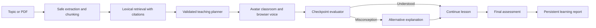

# Edukriti

Edukriti is a multilingual, adaptive AI teacher that converts a topic or uploaded study material into a grounded, avatar-led lesson. It explains concepts, shows subject-aware visuals, checks understanding, diagnoses misconceptions, changes its teaching approach, conducts a final assessment, and remembers the result.

## Working prototype

The public demo is available at [vercel-sigma-eight-16.vercel.app](https://vercel-sigma-eight-16.vercel.app). Its Cloudflare-compatible application origin is [edukriti-ai-teacher.fuzailahmad2006.chatgpt.site](https://edukriti-ai-teacher.fuzailahmad2006.chatgpt.site).

Canonical journey:

> Upload or topic → personalization → lesson plan → AI classroom → checkpoint → adaptive re-teaching → final assessment → learning report

## Key capabilities

- PDF and plain-text ingestion with page-aware extraction and citations
- Retrieval-augmented lesson grounding with safe no-evidence behavior
- Personalized 5-, 20-, and 60-minute lesson structures
- Beginner, intermediate, and advanced teaching depth
- English, Hindi, and Hinglish narration
- Human-like teacher avatar, browser voice, synchronized captions, and teaching controls
- Equations, diagrams, graphs, code, timelines, maps, and key-point visuals selected by subject
- Semantic checkpoint evaluation and misconception detection
- Contextual Ask Aarohi tutoring with lesson-grounded answers and spoken follow-ups
- Observable re-teaching through a different analogy and visual strategy
- Three-to-five-question final assessment with immediate feedback
- Durable scores, strengths, weak concepts, misconceptions, revision advice, and next-topic recommendations

## Architecture



The application uses a Node.js 24 npm-workspace monorepo, strict TypeScript, Vinext/React, Cloudflare Workers, D1 for structured learning history, and R2 for uploaded materials. Zod validates every public and module boundary.

## AI, RAG, and teaching approach

- `packages/rag` normalizes untrusted document text, creates bounded overlapping page chunks, and ranks evidence for the learner’s goal.
- `packages/teaching-engine` controls lesson depth, narration, visuals, checkpoints, semantic evaluation, adaptations, assessments, and report calculation.
- The optional OpenAI Responses provider uses strict structured output and server-only credentials. A deterministic teaching provider keeps the complete demo functional without a paid API.
- This is a single-teacher pipeline, not a multi-agent architecture. Uploaded content is treated only as evidence and never as executable instructions.

## Voice, avatar, and video experience

The teacher portrait was generated specifically for Edukriti. Narration uses the browser Web Speech API, so no voice secret reaches the browser and no paid text-to-speech service is required. The classroom combines the speaking teacher, captions, timed segments, and subject-aware visuals into the video-led learning experience.

## Local setup

Requirements: Node.js 24 and npm.

```bash
npm install
npm run dev
```

Before publishing:

```bash
npm run verify
git diff --check
```

The web application expects Cloudflare bindings `DB` for D1 and `FILES` for R2. Sites creates and injects their hosted resources from `apps/web/.openai/hosting.json`.

## Main APIs

| Endpoint | Purpose |
| --- | --- |
| `POST /api/sources` | Validate, store, and extract uploaded material |
| `POST /api/retrieval` | Retrieve grounded source passages |
| `POST /api/lessons` | Generate and persist a personalized lesson |
| `GET /api/lessons/:id` | Retrieve a validated lesson plan |
| `POST /api/checkpoints` | Evaluate and adapt during teaching |
| `GET/POST /api/assessments` | Load and answer the final assessment |
| `POST /api/reports` | Generate a report from recorded answers |
| `GET /api/reports/:id` | Retrieve a completed learning report |

## Third-party services and libraries

- OpenAI Responses API: optional structured lesson generation; not required for the deterministic demo
- Cloudflare Sites/Workers, D1, and R2: hosting and persistence
- `unpdf`: local PDF text extraction
- Zod: runtime contracts
- React, Vinext, Tailwind CSS, Base UI, and Lucide: application interface
- Browser Web Speech API: voice playback

## Known limitations

- The prototype supports PDF and TXT uploads; DOCX and PPTX are roadmap formats.
- Voice quality and available languages depend on the learner’s browser and operating system.
- The avatar is a polished still portrait with speaking-state motion, not real-time photorealistic lip synchronization.
- Semantic evaluation is optimized for the demonstration topics and should use a production model plus broader evaluation sets before high-stakes use.
- Authentication is owner-only for the hackathon deployment; institutional multi-user roles are outside tonight’s MVP.
- Seven-day study scheduling is outside the defined MVP.

## Project phases

- [x] Phase 1: product scope and user journey
- [x] Phase 2: application foundation
- [x] Phase 3: document processing and RAG
- [x] Phase 4: AI teaching engine
- [x] Phase 5: avatar, voice, and visual experience
- [x] Phase 6: interaction and adaptation
- [x] Phase 7: assessment and learner profile
- [x] Phase 8: integration, verification, and demo readiness
- [x] Phase 9: interaction reliability and natural teacher voice
- [x] Phase 10: richer knowledge engine, contextual AI tutor, and voice speed controls
- [x] Phase 11: one-click public demo and shareable lesson journeys
- [x] Phase 12: conversational tutor memory and persistent voice preferences
- [x] Phase 13: automatic notes, flashcards, and a seven-day revision plan

See [Phase 13 notes](docs/phase-13-revision-studio.md), [Phase 12 notes](docs/phase-12-conversation-voice.md), [Phase 11 notes](docs/phase-11-public-demo.md), and [demo script](docs/demo-script.md).
